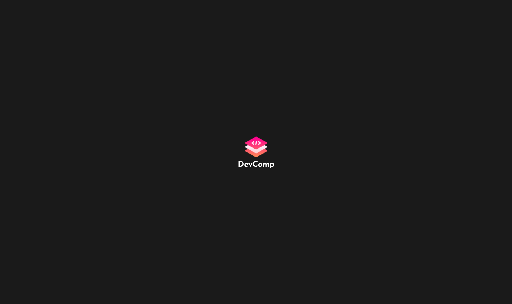
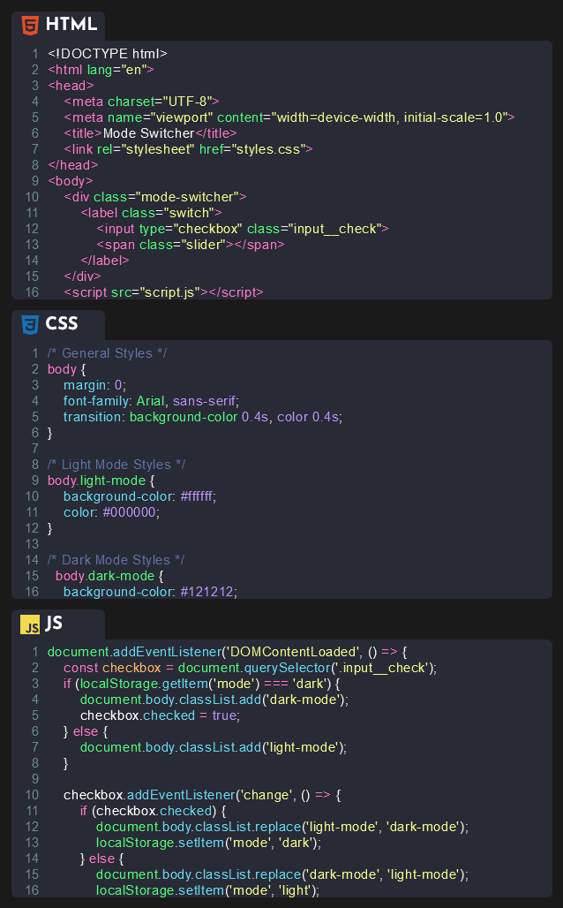
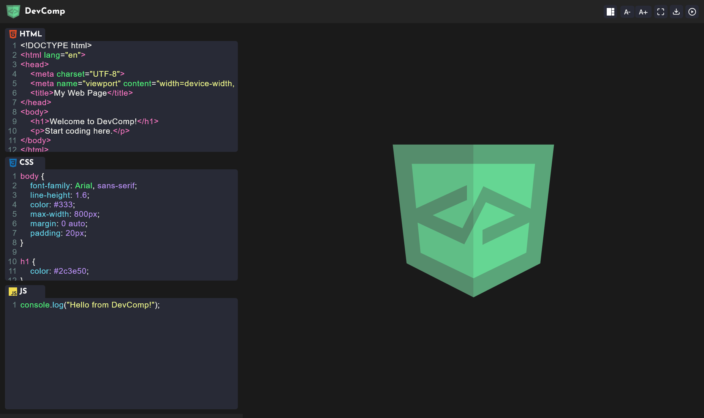
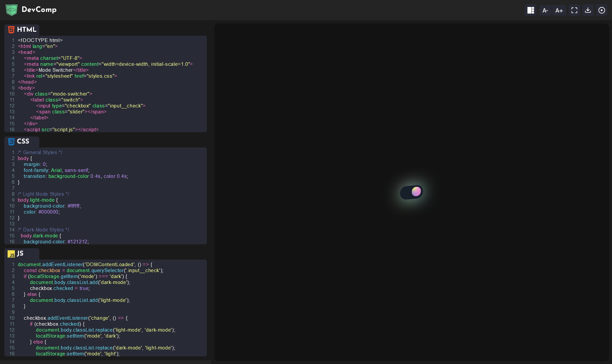

# DevComp - Web-based Code Editor

DevComp is a lightweight, browser-based code editor that supports HTML, CSS, and JavaScript development with real-time preview capabilities.

## Features

- 🎨 Syntax highlighting for HTML, CSS, and JavaScript
- 👀 Real-time preview of your code
- 📱 Responsive design that works on desktop and mobile
- 🎯 Live code execution
- 💾 Project download functionality
- 🔧 Customizable interface with font size controls
- 📺 Full-screen mode
- 🌗 Dark theme support

## Screenshots

### Loading Screen

*The initial loading screen of DevComp*

### Code Editor View

*The main interface of DevComp showing HTML, CSS, and JavaScript panels*

### Webpage Homepage

*An example of a webpage created using DevComp*

### Working Example

*Demonstration of a working code example in DevComp*

## Technologies Used

- CodeMirror for code editing
- JSZip for project download functionality
- FileSaver.js for handling file downloads

## Setup

1. Include the required dependencies:
```html
<link rel="stylesheet" href="https://fonts.googleapis.com/css?family=Josefin+Sans:300,400,500,600,700">
<link rel="stylesheet" href="https://cdnjs.cloudflare.com/ajax/libs/codemirror/5.16.0/codemirror.css">
<link rel="stylesheet" href="https://cdnjs.cloudflare.com/ajax/libs/codemirror/5.16.0/theme/dracula.css">
<script src="https://cdnjs.cloudflare.com/ajax/libs/codemirror/5.16.0/codemirror.js"></script>
<script src="https://cdnjs.cloudflare.com/ajax/libs/jszip/3.7.1/jszip.min.js"></script>
<script src="https://cdnjs.cloudflare.com/ajax/libs/FileSaver.js/2.0.5/FileSaver.min.js"></script>
```

2. Include the project files:
- `index.html`
- `style.css`
- `editor.js`

## Usage

1. Open `index.html` in your web browser
2. Write your HTML, CSS, and JavaScript code in the respective panels
3. Click the "Run" button to see the results in the preview panel
4. Use the font size controls to adjust the editor text size
5. Toggle full-screen mode for a better coding experience
6. Download your project as a ZIP file containing all necessary files

## Keyboard Shortcuts

- Font Size: Use the A+ and A- buttons to adjust the editor font size
- Full Screen: Click the expand icon to toggle full-screen mode
- Run Code: Click the play button to execute and preview your code

## Accessibility

DevComp is built with accessibility in mind:
- ARIA labels for all interactive elements
- Keyboard navigation support
- Screen reader friendly interface
- High contrast theme

## Browser Support

DevComp works in all modern browsers including:
- Chrome
- Firefox
- Safari
- Edge

## License

This project is open source and available under the MIT License.

## Contributing

Contributions are welcome! Please feel free to submit a Pull Request.